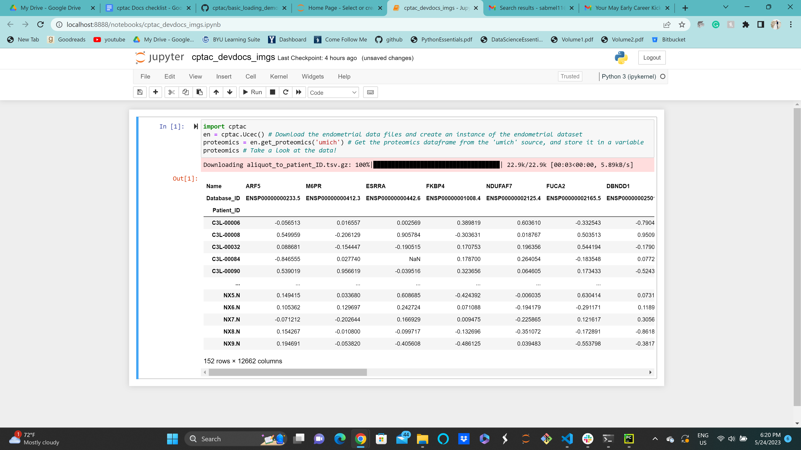
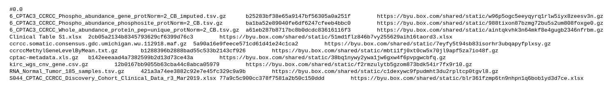
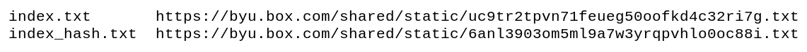
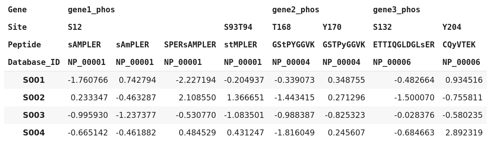
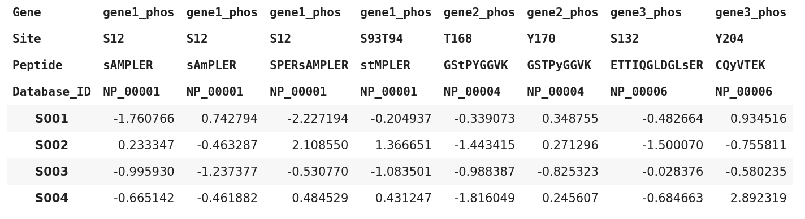
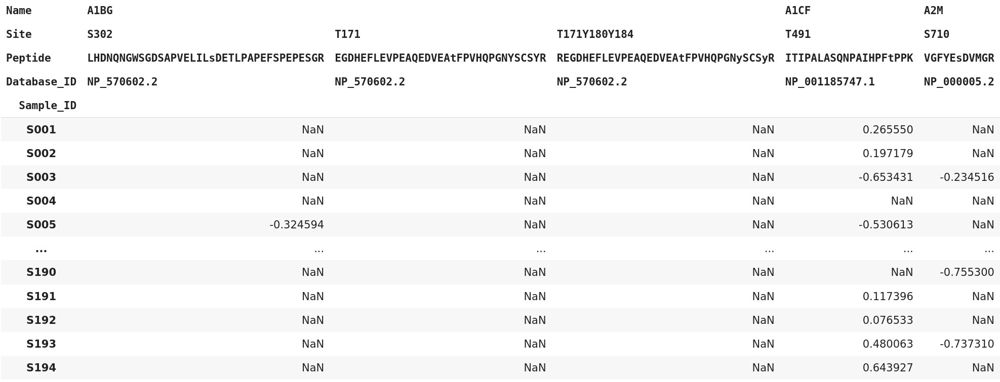
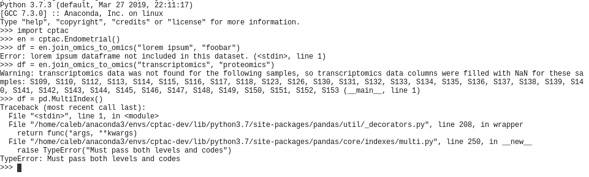

```
"WELCOME TO CPTAC!

cptac is a package of adventure, danger, and low cunning. In it you will
explore some of the most amazing data ever seen by mortals. No computer should
be without one!"
```
(a paraphrase of the opening to the beloved 1977 text-based adventure game [Zork](https://en.wikipedia.org/wiki/Zork) created at MIT by Tim Anderson, Marc Blank, Bruce Daniels, and Dave Lebling)

This document will explain what cptac is, how it is structured, and why we chose to structure it that way.


# What the package does

The cptac package distributes cancer datasets generated by the National Institute of Health's [Clinical Proteomic Tumor Analysis Consortium](https://proteomics.cancer.gov/programs/cptac) (CPTAC). Each dataset consists of several tables of proteogenomic data about a particular type of cancer, gathered from approximately 100 tumor tissue samples and 30 normal tissue samples. Types of data in the tables include protein expression levels, RNA expression levels, protein phosphorylation levels, somatic mutations, and other molecular data. Each dataset also contains one or more tables of clinical data (age, gender, medical history, clinical attributes, etc.) for the patients the samples came from.

Our package delivers these data tables in a Python environment, as pandas DataFrames. These function similarly to R dataframes, and are ready to be directly piped into whatever statistical, machine learning, graphing, or other Python packages a researcher may want to use to analyze the data. Although the tables come to us in a variety of formats, we carefully parse them to be in the same format across all datasets, so you don't have to learn an entirely new format when you switch from working with one dataset to another. This means that a researcher can easily take an analysis they've run on one dataset, and run it almost seamlessly on any other dataset.

cptac is freely distributed through the Python Package Index (PyPI). Anyone can install the package using the pip program:

`pip install cptac`


# Basics of how the package works

Currently (August 2022), the package contains 10 datasets:

*   Breast cancer (BRCA)
*   Clear cell renal cell carcinoma (CCRCC)
*   Colon cancer (COAD)
*   Endometrial cancer (UCEC)
*   Glioblastoma (GBM)
*   Head and neck squamous cell carcinoma (HNSCC)
*   Lung adenocarcinoma (LUAD)
*   Lung squamous cell carcinoma (LSCC)
*   Ovarian cancer (OV)
*   Pancreatic ductal adenocarcinoma (PDAC)

This list will continue to grow as the consortium generates more datasets. All of these data files would be too much for a user to download all at once when they install the package; additionally, PyPI limits the size of our package to 60 MB. So, instead of storing the data files as part of the package, we store them remotely, and provide a function in cptac, cptac.download, for downloading the dataset files that the user wants to work with. Currently, the files are stored on Sam's Box drive.

Once a user has downloaded the data source files for their desired dataset, they can use cptac to access and work with that data in a Python interpreter or script. We chose to have users interface with each dataset through a Python class representing that dataset. Each dataset class reads and parses the dataset's files into dataframes when it's initialized, stores the dataframes in a private dictionary, and provides "get" methods to allow the user to access the dataframes. It also provides functions that handle complex joining between different dataframes.

For example, this is how a user would download the endometrial dataset, load it in their python interpreter, and then get the proteomics dataframe:



# How we did it

In this section, we'll go through how we implemented the package.


### Data storage and versioning

The data for each dataset are currently stored on Dr. Payne's Box drive. Here is a sketch of the file structure we use on Box for storing the data:

```
cptac/
    version.txt
    data_brca/
    data_ccrcc/
        index.txt
        index_hash.txt
        ccrcc_v0.0/
            ccrccMethylGeneLevelByMean.txt.gz
            ccrcc.somatic.consensus.gdc.umichigan.wu.112918.maf.gz
            Clinical Table S1.xlsx
            cptac-metadata.xls.gz
            kirc_wgs_cnv_gene.csv.gz
            ...
    data_colon/
    data_endometrial/
    ...
```

As you can see, we refer to each dataset by an acronym or short name. BRCA is for breast cancer, CCRCC is for clear cell renal cell carcinoma, endometrial is short for uterine corpus endometrial carcinoma (UCEC), and so on. 

Each dataset has its own folder on the Box drive. Within that folder, there is an index that keeps a record of all data files for all versions of the dataset. There is also a hash of that index. Finally, within the dataset folder, there is also a sub-folder for each version of the dataset. In the example above, you can see the CCRCC only has one data version (0.0), so there is only one sub-folder. This folder contains all the data files for that version of the dataset.

As I mentioned above, the index file keeps track of all files for all versions of the dataset. Here is what an index file looks like (this example is the CCRCC index):




The first line, "#0.0", identifies the data version that the following lines will contain information for. Then, each following line has first the name of a file (including the .gz extension if it is gzipped), then a tab character, then the md5 checksum for the file, then another tab character, and then the direct download URL for the file. Thus, the index is a tsv file, except for the lines beginning with '#' characters.

The index_hash.txt file contains the md5 checksum of the current version of the index.txt file. It literally contains just that hash and nothing else--not even any whitespace.

Several datasets have more than one data version. The index contains the information for all data versions of the dataset. Each data version has its own section, marked by a line starting with at '#' character and followed by the data version for the following lines. For example, if the endometrial dataset had multiple data versions, this is what the index file would look like. Note that there are some differences between the versions in how many files exist, and in the checksums for the files.


This is what the structure of the data_endometrial folder would look like with multiple versions of the endometrial dataset:

```
data_endometrial/
    index.txt
    index_hash.txt
    endometrial_v2.0/
        clinical.txt
        CNA.cct.gz
        definitions.txt
        ...
    endometrial_v2.1/
        acetylproteomics.cct.gz
        clinical.txt
        CNA.cct.gz
        ...
```


### Downloading the data

When a user installs the cptac package, it is installed to a package installation directory at one of the following locations (if they're using Anaconda):

`~/anaconda3/lib/python3.7/site-packages/cptac` if they've installed it to their base environment, or 

`~/anaconda3/envs/[ENVIRONMENT NAME]/lib/python3.7/site-packages/cptac` if they've installed it to a different environment.

 Within the package installation directory, they get a file structure that looks like this:

```
cptac/
    __init__.py
    brca.py
    ccrcc.py
    colon.py
    dataframe_tools.py
    dataset.py
    endometrial.py
    ...
    data_brca/
        index_urls.tsv
    data_ccrcc/
        index_urls.tsv
    data_colon/
        index_urls.tsv
    data_endometrial/
        index_urls.tsv
    ...
```

The various .py files contain the code for running the package. We will discuss those in a moment. The folders with the "data" prefix are the folders for storing the data files for each dataset. For every dataset folder on Box, there is a corresponding data folder within the package. However, as you can see, when a user first downloads the package, these data folders don't contain any data files, because the user hasn't downloaded any yet.

What each data folder does contain is an `index_urls.tsv` file for that dataset. This tsv file contains the direct download URLs for the index for that dataset, and the index hash for that dataset, both of which you saw in the Box drive. This is what the file looks like for CCRCC:





As you can see, it's a small, simple file. It has the same format for every dataset. The first line has the name of the index file, then a tab character, then the direct download URL for the index; the second line has the name of the index hash file, then a tab character, then the direct download URL for the index checksum.

When a user runs the cptac.download function, located in the `cptac/file_download.py` file, the function uses the URLs from index_urls.tsv to download index.txt from Box, and then to download index_hash.txt and check against the slim chance of the index being corrupted on download. It saves index.txt in the data folder, and then creates a subdirectory in the data directory, for the data version the user has requested to download. It then uses the URLs from the index file to download the data files and save them to the version subdirectory. After each download, it hashes the file and checks it against the hash provided in the index, to make sure nothing went wrong during the download.

After downloading a couple datasets, the file structure in the installation directory on the user's machine will look something like this:

```
cptac/
    __init__.py
    brca.py
    ccrcc.py
    colon.py
    dataframe_tools.py
    dataset.py
    endometrial.py
    ...
    data_brca/
        index_urls.tsv
    data_ccrcc/
        index.txt
        index_urls.tsv
        ccrcc_v0.0/
            ccrccMethylGeneLevelByMean.txt.gz
            ccrcc.somatic.consensus.gdc.umichigan.wu.112918.maf.gz
            Clinical Table S1.xlsx
            cptac-metadata.xls.gz
            kirc_wgs_cnv_gene.csv.gz
            ...
    data_colon/
        index_urls.tsv
    data_endometrial/
        index.txt
        index_urls.tsv
        endometrial_v2.1/
            acetylproteomics.cct.gz
            clinical.txt
            CNA.cct.gz
            definitions.txt
            miRNA.cct.gz
        ...
    ...
```

In the example above, the user has downloaded version 0.0 of the CCRCC data, and version 2.1 of the endometrial data.


### Downloading password-protected datasets

Some datasets are not yet publicly released. Box allows you to require a password to download a file from a shared URL, so we used this functionality, and set the password to be the same for all files within a particular dataset. We prompt the user to type in the password through the command line when they request to download a password-protected dataset, and then behind the scenes we pass the password to the Box webpage using the Python requests package.


### Loading and accessing datasets

Once a user has downloaded a dataset, they can access it in their Python interpreter, or in a script. Here, we will provide a step-by-step explanation of what happens as the user executes basic commands for accessing and working with a dataset.


*   `import cptac`
    *   This imports the package into the current namespace, and runs everything in `cptac/__init__.py`, which defines some helper functions (cptac.list_datasets, cptac.how_to_cite, etc.), sets up error and warning handling for cptac-generated errors and warnings (more on that later), and checks that the package is up-to-date.
*   `en = cptac.Endometrial()`
    *   This creates an instance of the Endometrial class, which is defined in `cptac/endometrial.py`, and calls the class's `__init__` function. 
    *   The Endometrial `__init__` function first calls the `__init__` function of its parent class, DataSet, located in `cptac/dataset.py`. This initializes several private variables self._data, which is the dictionary for holding the dataset's dataframes.
    *   The Endometrial `__init__` then calls the update_index function, located in `cptac/file_download.py`, to check that the index is downloaded and up to date. If there's no internet, this check fails silently, and the user can still use the dataset.
    *   The `__init__` function then calls the validate_version function, located in `cptac/file_tools.py`, to parse the version parameter passed in the class instantiation.
    *   Then, the `__init__` gets a list of the paths to all the data files for the dataset (assuming they're downloaded), and reads them in one by one, using a series of elif statements to read in each file as it needs to be, and then saving each dataframe as a value in the self._data dictionary, with the name of the dataframe as the key.
    *   Finally, the `__init__` performs a series of operations to properly format each dataframe, and reindex them with sample IDs as needed.
*   `prot = en.get_proteomics()`
    *   Like all of the get, join, and other member functions of the Endometrial class, get_proteomics is inherited from the DataSet class (in `cptac/dataset.py`). 
    *   get_proteomics calls the private Dataset._get_dataframe function, passing "proteomics", to get the proteomics dataframe.
    *   _get_dataframe checks that the dataframe is included in the dataset's self._data variable, and then makes a deep copy of the dataframe and returns it to get_proteomics. get_proteomics then returns it to the user. Returning a deep copy ensures that any operations performed by the user on the dataframe don't affect the master copy stored in self._data.


### Using the package without an internet connection

Wherever possible, cptac is written so it can still be used without an internet connection. Obviously, you can't download data files without internet, but if a user has already downloaded the files for a dataset, they load and work with the dataset just fine.


### Multi-level column indices

We take great care to ensure that none of the dataframes have duplicate columns. Most of the omics dataframes have gene names as the column headers, but sometimes there are duplicated gene names, obviously in phosphorylation and acetylation dataframes, but also sometimes in other omics dataframes. To solve this problem, we use a multi-level index as the column headers, where needed. We implement this with a pandas MultiIndex (see [this page for documentation from pandas](https://pandas.pydata.org/pandas-docs/stable/user_guide/advanced.html)). 

Briefly, a multi-level index is where each data series has multiple keys associated with it, kind of like having a named tuple for the index. This allows us to include the keys necessary to uniquely identify each column. Every data series will have the same number of keys, and each key belongs to a "level" of the multiindex--the first keys for all the data series make up the first level of the multiindex, the second keys make up the second level, and so on.

The phosphorylation and acetylation dataframes have four levels in their column index: Name (gene name), Site, Peptide, and Database_ID. Other omics dataframes with multi-level column indices have some or possibly all of these levels, as needed to uniquely identify each column. 

First, we will show what this sort of multiindex would look like for a simple mockup dataframe, for illustration:





Each column has its own key value for each level (Gene, Site, Peptide, Database_ID) of the multiindex. In other words, each column has its own gene, site, peptide, and database ID associated with it. However, note that when several adjacent columns have the same key for a particular level of the column index, that key is only printed for the first column, to improve readability. For example, in the table above, the first 4 columns all are for gene1, but that label is only shown for the first column. The first 3 columns also all have the same site, so the site is only shown for the first of the 3. The 4th column has a different site, so that's shown.

To help illustrate the concept of a multiindex, though, we show the image below, which is the same mockup dataframe as above, but showing every key for every column--in other words, not hiding repeat keys. Thus, the first 4 columns all have "gene1_phos" as their key for the "Name" level, and the first 3 columns all also have "S12" as their key for the "Site" level. In normal printing, the repeated key would only be shown for the first column in the group.




Below, we print an example of what an actual dataframe with a multi-level column index looks like. This is the phosphoproteomics dataframe from the clear cell renal cell carcinoma (CCRCC) dataset.





Multi-level indexing has many advantages as a method for uniquely identifying columns. It makes it simple to select columns based on any combination of keys, because each key is a different element in the tuple, so it's easy to look at just a single key, or multiple keys, when selecting data. For example, we could select all columns with a particular gene name, or look at columns with a particular type of site in the "Site" level of the index. 

We provide a helper function, DataSet.reduce_multiindex, to make it easier for users to work with dataframes that have multi-level column indices. It has a `levels_to_drop` parameter that allows a user to drop one or multiple levels from a column multiindex, and it warns the user if such an operation creates any duplicated column headers. It also has a `flatten` parameter that provides the option to concatenate the values from each level of the index into a single string for each column header, thus create a single-level index, but avoiding duplicate column headers. By default, it uses an underscore as the separator character between the values joined from different levels, but the user can specify a different character.


### Merging dataframes

cptac provides five built-in functions for joining different dataframe types:


*   join_omics_to_omics
*   join_omics_to_mutations
*   join_metadata_to_metadata
*   join_metadata_to_omics
*   join_metadata_to_mutations

These functions handle numerous details that would normally make joining tables a complicated process for users. As a result, it is very easy for users to join columns from multiple tables, for their analyses. Here are some features of the join functions:


*   When a column is selected from a dataframe, the name of the dataframe it came from is appended to the value of the Name level of the column header, to avoid confusion about which columns are which in the joined dataframe.
*   When two dataframes are joined that have a different number of levels in their column indices, levels filled with NaNs are added to the column index of the dataframe with less levels, so they are compatible for joining.
*   The join functions use full outer joins. If this causes any cells to be filled with NaN because there wasn't a value in that column for a particular sample that did exist in the other dataframe, the function warns the user.
*   When joining an omics or metadata dataframe to the mutations dataframe, the join function automatically handles the work of selecting the specified mutations from the somatic mutation dataframe, and reformatting the table to be joinable with an omics or metadata dataframe.
*   When there are multiple mutations for a single sample in a particular gene, the join_omics_to_mutations and join_metadata_to_mutations functions have a `mutations_filter` parameter that allows you to filter those multiple mutations down to a single mutation, using either a default priority, or using a priority the user supplies.

(Note that some metadata tables, such as treatment and medical_history, have multiple rows for each sample, and as a result cannot be used in join functions.)


### Package checks if it's up-to-date

As noted earlier, cptac automatically checks that it's up-to-date, every time a user imports it. This is done in the `cptac/__init__.py` file. The package version is checked by using the hardcoded download URL to download the version.txt file on Box and read it into a string, and then comparing that string with the return value of cptac.version(). If the two values do not match, a warning that the package is out-of-date is printed to stderr.


### Exceptions and warnings

There are various reasons that an exception or warning might need to be raised by cptac. For example, a user may pass the wrong type of parameter to a function, or request a dataframe or column that doesn't exist in that particular dataset, or create duplicate levels in a column multiindex when they request to drop a particular level. If a problem is severe enough that the entire operation needs to be cancelled, cptac does so by raising an exception. If the issue is not fatal, and is merely something the user should be aware of, cptac issues a warning, using the standard Python warnings module. This design is clean and simple. Additionally, since all warning and exception messages are sent to stderr, not stdout, it is easy for a user to separate the output of a command or script from the warning or error messages--they simply just pipe stderr and stdout to different output files.

The disadvantage to exceptions and warnings is that their syntax can be confusing or intimidating to users with less coding experience, and that includes many biologists who we hope will use this package. To solve this problem, we created custom exception and warning classes for all exceptions and warnings generated by cptac. They are defined in `cptac/exceptions.py`. Then, in the package initialization code in `cptac/__init__.py`, which is run immediately when a user imports the package, we set a custom exception hook (sys.excepthook) and warning displayer (warnings.showwarning). When an exception or warning is routed through one of these, they check whether it inherits from CptacException or CptacWarning, the base classes for all the exceptions and warnings defined in `cptac/exceptions.py`. If it is, the exception or warning message is parsed and printed in a simple, non-intimidating format, and the user can go on their merry way. If the exception or warning originated from another source, however, it is printed in the default format. We've included an example below.





### Utils sub-module

cptac includes a sub-module, cptac.utils, which provide various utility functions for various tasks such as performing t-tests, getting interacting proteins, and finding which genes are most frequently mutated in a dataset.

