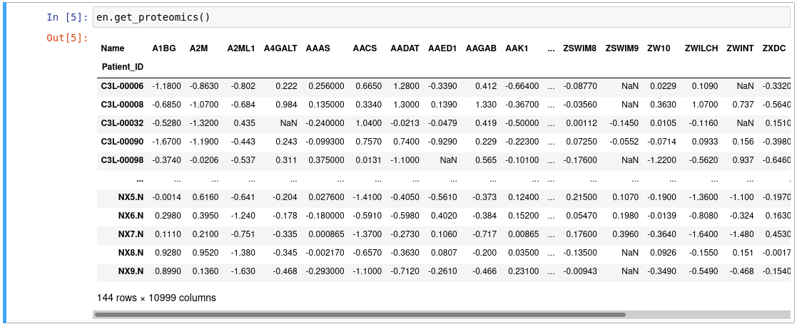
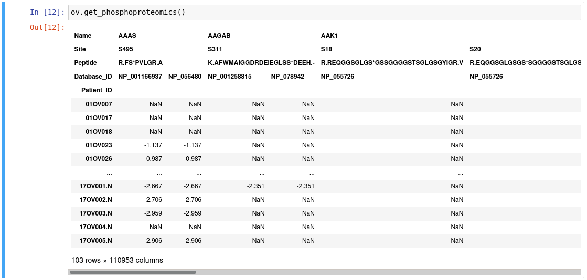

**Adding the data files for a new dataset**

1. Download the data files onto your machine.
2. gzip the files (unless they're Excel files--then just leave them uncompressed).
3. Use md5sum to hash all the files, and send the output to a file called `index.txt`.
4. Reformat this index.txt that you just created:
    1. On each line, have the file name and hash for one file. This is the format of the md5sum output, but you need to edit it so the filenames are first, followed by a tab and no other whitespace, followed by the file hash, followed by no other whitespace.
    2. At the top of the file, add a line that has the version number preceded by a crunch, e.g. "#3.1" for version 3.1
5. Create a folder on the Box drive for the new dataset, inside the `CPTAC/cptac` directory (not `CPTAC/cptac_raw` or `CPTAC/cptac_old`), with the format `data_[dataset]`, e.g. `data_endometrial`. Within that folder, create another folder with a name formatted as `[dataset]_v[version]`, e.g. `endometrial_v2.1`. Upload all the compressed data files to this second folder.
    3. To be clear, for the endometrial dataset, you'd create `data_endometrial` and `data_endometrial/endometrial_v2.1`, and upload the data files to `data_endometrial/endometrial_v2.1`
6. Create a shared direct download link for each file, and store it in index.txt:
    4. Click on the file
    5. Click on the "Share" button for the file
    6. In the box that pops up, click the switch to "Enable shared link"
    7. Change the access level from "Invited people only" to "People with the link", leaving the access level on "Can view and download"
    8. Click on the "Link settings" button, and at the bottom of the new box that pops up, you'll find the link to directly download the file, under the header "Direct Link". This is the link we need to put in our index; the link in the previous popup box was just for viewing the file.
        1. Optional: If you need to password protect the file, check the "Require password" box under the "Password Protect" header and enter the desired password. It must be the same password for all files within one dataset.
    9. Copy the direct download link, and paste it into index.txt. Put it on the same line as the file it corresponds to, after the hash, separated from the hash by a tab and no other whitespace, and followed by no other whitespace.
7. Now that you've finished the index file, use md5sum to create a checksum for the index file, and store the hash in a file called `index_hash.txt`. md5sum will automatically output both the hash and file name, but you just want the hash, so delete the file name. Also make sure there is no whitespace before or after the hash.
8. Upload index.txt and index_hash.txt to the parent directory you created for the dataset--for example, with the endometrial dataset, you'd upload them to the `data_endometrial/` folder, not to `data_endometrial/endometrial_v2.1/`. 
9. Create shared direct download links for the index.txt and index_hash.txt files, following the same steps as for creating shared direct download links for the data files. Even if this is a password protected dataset, you do not need to password protect these files.
10. Within the cptac/cptac directory in the copy of the git repository on your local machine, create a directory for the dataset, with the format `data_[dataset]`, e.g. `data_endometrial`.
11. Within that directory, create a file called `index_urls.tsv`. The first line of this file should have the name of the index file (`index.txt`), followed by a tab, followed by the direct download link for the index file. The second line of this file should have the name of the index hash file (`index_hash.txt`), followed by a tab, followed by the direct download link for the index hash file. There must be no extra whitespace on either line.
12. Add index urls file to the MANIFEST.in file, which is in the same directory as setup.py
13. Add dataset's data folder to the .gitignore, which is in the same directory as setup.py, but use and exclamation point to include the index_urls.tsv file (see existing entries in the .gitignore for examples)

**Adding the code for a new dataset **

1. Write a dataset loader, stored in the cptac/cptac/ directory, and having the dataset name, all lowercase, as the filename, with .py as the extension. For example, the loader for the endometrial dataset is called `endometrial.py`; for the CCRCC dataset, it's called `ccrcc.py`.
    1. See child_dataset_template.py for more info.
2. At the top of `cptac/__init__.py`, add a line to import the dataset class from its file, using the lowercase file name and the UpperCamelCase dataset name (e.g. `from .ccrcc import Ccrcc`)
3. Add the dataset and its associated info to cptac.list_datasets()
4. Make sure all dfs in self._valid_metatdata_dfs and self._valid_omics_dfs in dataset.py are valid as metadata or omics dfs, respectively, for the utilities functions. If not, override those lists for the dataset class.
5. If the dataset is password protected, add it to the password_protected_datasets list in the download function in the `cptac/file_download.py` file.
6. At the point marked in the child dataset template, write code to format the dataframes according to the specifications below.

**General dataframe formatting requirements**

First, I'll give you two pictures showing the general format that you want to parse all the data tables to conform to:

Here is an example of a table with a single level column index:

Here is an example of a table with a multi level column index:

These tables conform to these requirements

*   Each column represents a particular variable. For omics tables, each column represents a gene/protein/etc. For metadata tables, each column represents a clinical variable (age, weight, etc.).
*   Each row represents a specific sample.
    *   Samples are indexed by their patient ID.
    *   All normal samples have '.N' appended to the end of the patient ID.
    *   Some patients donated both a tumor sample and a normal sample. Both samples should have the same patient ID; the only difference between the two will be that the normal sample has '.N' appended to the end of it.
        *   In some datasets, such as HNSCC, there are also cored normal samples. These are marked with a '.C' at the end of the patient ID, and in the clinical dataframe have the value "Normal" in the Sample_Tumor_Normal column, and the value true in a column you create called Cored_Sample. See the "Formatting requirements for specific dataframes" section of this document for details.
*   No duplicate column headers or index values.
    *   Check by calling the 'df.index.duplicated().any()' and 'df.columns.duplicated().any()' functions; both should return False.
    *   Exception: The somatic_mutation dataframe will have multiple rows for each sample, so it will have duplicate index values.
        *   Some metadata dataframes, such as the treatment dataframe in Ovarian or medical_history dataframe in Ccrcc, may also have multiple rows for each sample. If so, they will need to be excluded from join functions. Check the _valid_omics_dfs and _valid_metadata_dfs lists and make sure that tables with duplicate index values aren't included in either of those lists.
    *   There may be duplicate column headers. If that's the case, you'll probably need to use additional identifiers to uniquely identify each column. We use a multi-level column index to accomplish this (see the 00_why_we_did_what_we_done document for more details).
    *   If you have duplicated samples, either there are multiple rows for each patient (as in the treatment or somatic_mutation dataframes), or you need to prepend an 'N' to the Patient_IDs of the normal samples.
*   Index and column names are standardized:
    *   The value of df.index.name is "Patient_ID" for all tables.
    *   For dataframes with single-level column indices, the value of df.columns.name is "Name".
    *   For dataframes with multi-level column indices, the name of the highest index level is "Name".
    *   This is all ensured by calling the standardize_axes_names function at the end of the dataset loader; see child_dataset_template.py
*   If it has a multi level column index:
    *   Include the minimum number of levels needed to uniquely identify each column. In addition to the gene name, you may need to include a level for a database identifier, a phosphorylation/acetylation site (if it's a phosphoproteomics or acetylproteomics file), and/or a peptide. If it's not a phosphoproteomics or acetylproteomics file, the gene name and database ID levels will probably be sufficient, since database IDs will be unique for different isoforms.
    *   Whatever of the possible multiindex levels you have must have these names, and be in this order: Name, Site, Peptide, Database_ID
*   The key for each dataframe in the self._data dictionary is the standard, all lowercase name for that dataset, as determined by the getter function for it. The getter functions for each table type are named "get_" followed by the exact name of the table type.
*   If the new dataset has a table type not included in any other datasets, you must write a getter for it in the parent DataSet class, found in `cptac/dataset.py`, using the private method DataSet._get_dataframe and passing the tissue_type parameter if it's an omics dataframe.
    *   You'd also need to add the new dataframe's name to self._valid_omics_dfs if it's a valid omics df for the DataSet merge functions, or self._valid_metadata_dfs if it's a valid metadata df for DataSet.append_metadata_to_omics
        *   Note that a dataframe with multiple rows for each sample, like the treatment dataframe in the Ovarian dataset, should **NOT** be a valid dataset for joining
*   Column names are consistent--e.g., all Sample_Tumor_Normal columns should be labeled as such, not as Sample_Status or something else. Rename columns as necessary to match this.

**Formatting requirements for specific dataframes**

*   somatic_mutation
    *   The somatic_mutation table should have 3 columns: Gene, Mutation, and Location.
    *   If you're parsing from a MAF file, then the columns you want will probably be named as follows:
        *   Patient_ID (for the index) will be named "Tumor_Sample_Barcode"
        *   Gene will be named "Hugo_Symbol"
        *   Mutation will be named "Variant_Classification"
        *   Location will be named "HGVSp_Short"
    *   Make sure the range of possible values in the Mutation column matches the lists for sorting between truncations and missense mutations in the function DataSet._filter_multiple_mutations. If the possible values don't match the default list of possible values, add an elif statement to handle the special case, as has been done for the Colon, GBM, and HNSCC datasets.
        *   This also affects the DataSet.get_genotype_all_vars function and the utils.get_frequently_mutated functions.
        *   The standard possible values are:
            *   'Frame_Shift_Del'
            *   'Frame_Shift_Ins'
            *   'Nonsense_Mutation'
            *   'Nonstop_Mutation'
            *   'Splice_Site'
            *   'In_Frame_Del'
            *   'In_Frame_Ins'
            *   'Missense_Mutation'
            *   'Silent'
*   clinical 
    *   Must contain a Sample_Tumor_Normal column, which contains either "Tumor" or "Normal" for each sample, according to its status.
        *   Make sure that the "Tumor" and "Normal" values are capitalized properly--can use Series.str.title() to fix if necessary
    *   In some datasets, such as HNSCC, there are also cored normal samples. You should mark the patient IDs for these samples with a '.C' at the end in all tables, instead of a '.N'. You also need to give them the value "Normal" in the Sample_Tumor_Normal column, and the value True in a column called Cored_Sample that you need to create in the clinical dataframe. All tumor and non-cored normal samples will have the value False in the Cored_Sample column.

**Tips for writing the parser/loader:**

*   If any dataframes are split between two files--such as one file for the tumor sample proteomics, and one file for the normal sample proteomics--they'll have been read into separate dataframes, and you need to merge those into one dataframe.
    *   Make sure that samples coming from the normal file have '.N' appended to their Patient_ID numbers, to keep a record of which ones are normal samples. You may need to do that manually.
*   Multiple metadata dataframes may be contained in one file, e.g. clinical and derived_molecular data might both be in clinical.txt, as in Endometrial. If that's the case, load the whole file and then assign different columns to the proper tables. Ask Dr. Payne if you have questions about which columns should go in what table.
*   If there's a column in the clinical or other metadata dataframe indicating that some samples were excluded from analysis, like in Endometrial, we'll probably just drop those samples from the data. Check with Dr. Payne.
